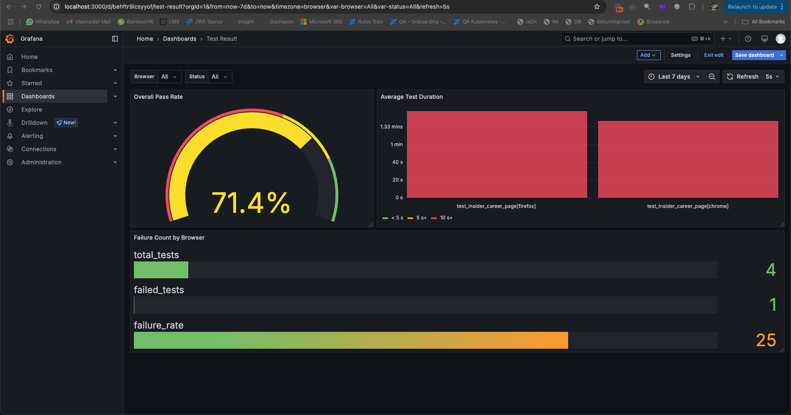

# Insider Career QA Automation Tests

This project implements automated end-to-end UI tests for the Insider careers website, focusing on QA job positions in Istanbul.

## Project Structure

```
Levent-Automation-HW/
├── requirements.txt        # Project dependencies
├── Jenkinsfile            # Jenkins pipeline configuration
├── pytest.ini            # Pytest configuration
├── Test Result-grafana-dashboard.json  # Grafana dashboard configuration
├── GrafanaSS/            # Grafana dashboard screenshots
├── src/
│   ├── config/           # Configuration files
│   ├── core/             # Core functionality
│   │   └── base_page.py  # Base page class with common methods
│   ├── pages/            # Page objects
│   │   ├── home_page.py  # Insider home page
│   │   ├── careers_page.py # Careers page
│   │   └── qa_careers_page.py # QA careers page
│   ├── tests/            # Test scripts
│   │   ├── conftest.py   # Pytest configuration
│   │   └── test_insider_career.py # Test for career page flow
│   └── utils/            # Utility functions
│       └── db_controller.py # Database operations using Docker MySQL commands
└── screenshots/          # Test failure screenshots (created during test runs)
```

## Prerequisites

1. Python 3.8 or higher
2. Chrome browser installed
3. ChromeDriver matching your Chrome browser version
4. Docker installed and running (for MySQL)
5. Jenkins (for CI/CD pipeline)

## Setup Instructions

1. Create and activate a virtual environment:
   ```bash
   # Create virtual environment
   python3 -m venv ~/python_venv
   
   # Activate virtual environment
   source ~/python_venv/bin/activate
   ```

2. Install project dependencies:
   ```bash
   pip install -r requirements.txt
   ```

3. Set up MySQL in Docker:
   ```bash
   # Create and start MySQL container
   docker run --name mysql-qa \
     -e MYSQL_ROOT_PASSWORD=123qwe123 \
     -e MYSQL_DATABASE=test_results \
     -p 3306:3306 \
     -d mysql:8
   
   # Create test results table
   docker exec -it mysql-qa mysql -u root -p123qwe123 test_results -e "
   CREATE TABLE IF NOT EXISTS ui_test_results (
       id INT AUTO_INCREMENT PRIMARY KEY,
       test_name VARCHAR(255) NOT NULL,
       status VARCHAR(50) NOT NULL,
       duration FLOAT NOT NULL,
       timestamp DATETIME NOT NULL
   );"
   ```

## Running Tests

1. Ensure MySQL container is running:
   ```bash
   docker start mysql-qa
   ```

2. Run tests:
   ```bash
   # Run all tests
   pytest src/tests/test_insider_career.py
   
   # Run with HTML report
   pytest src/tests/test_insider_career.py --html=report.html
   ```

## Test Results

- Test results are stored in MySQL database
- Screenshots of failed tests are saved in the `screenshots/` directory
- HTML reports are generated when using the `--html` option
- Test results are visualized in Grafana dashboard

## Database Configuration

The test framework uses the following MySQL configuration:
- Host: mysql-qa (Docker container name)
- User: root
- Password: 123qwe123
- Database: test_results
- Table: ui_test_results

## Grafana Dashboard Design

The project includes a Grafana dashboard for visualizing test results and metrics. The dashboard provides insights into:
- Test execution status
- Test duration trends
- Success/failure rates
- Test execution history



The dashboard is designed to provide real-time monitoring of test execution and results, making it easier to track test performance and identify potential issues.

## CI/CD Pipeline

The project includes a Jenkins pipeline configuration that:
- Checks out the code from Git
- Sets up Python environment
- Runs tests
- Archives test results
- Cleans up workspace

## Troubleshooting

1. If Chrome doesn't open:
   - Ensure Chrome browser is installed
   - Check if ChromeDriver version matches your Chrome browser version
   - Make sure no other Chrome instances are running

2. If MySQL connection fails:
   - Verify Docker is running
   - Check if mysql-qa container is running
   - Ensure correct credentials are used

3. If Jenkins pipeline fails:
   - Check Jenkins logs for detailed error messages
   - Verify Git repository access
   - Ensure all required plugins are installed

## Cleanup

To stop and remove the MySQL container:
```bash
docker stop mysql-qa
docker rm -f mysql-qa
``` 